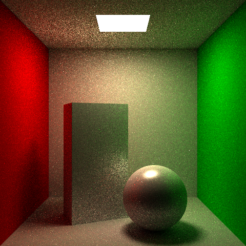

# Real-time Ray Tracer

This project is a real-time ray tracer developed with Nvidia OptiX. We implemented multiple rendering techniques to reduce noise and generate more realistic results, including Monte Carlo Direct Lighting, Indirect Path Tracer, Russian Roulette, Multiple Importance Sampling. 

## Rendering Results
Indirect Path Tracer with Next Event Estimation (NEE)\
Scene: Cornell Box\

